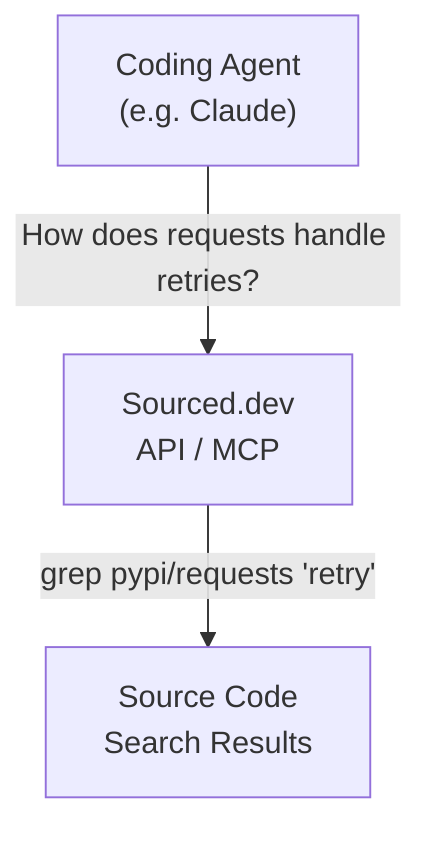
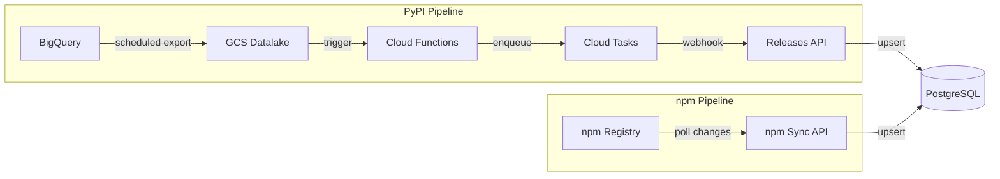

# Sourced.dev — From package to source code.

Sourced.dev continuously ingests release metadata from major package managers to give your coding agent direct access to dependency source code as if it existed on your local machine.

Currently tracking all 800,000+ Python packages and all 3,000,000+ NPM packages. New releases are indexed within 5 minutes of being published.

## How It Works

1. **Lookup any package**: Query any package across ecosystems to see its versions, metadata, and source repository
2. **Search source code**: Grep through any dependency's source code by providing `ecosystem/package_name` and a search pattern
3. **Agent-native**: Coding agents like Claude can search dependency source code as naturally as they search your local codebase

## Why This Matters

Today, coding agents either hallucinate API usage, rely on outdated training data, or waste time on slow web searches that hit 403s and rate limits. Sourced.dev gives them instant, reliable access to actual source code for any package — no web scraping, no blocked requests, no waiting.

- **Fast**: Sub-second API responses. No web searches, no 403s, no rate limits
- **Fresh**: New releases indexed within 5 minutes of being published to any registry
- **No hallucinations**: Agents work with real source code, not outdated training data
- **Agentic search**: Grep through any dependency as if it were on your local machine
- **Deep understanding**: Agents can read implementation details to provide accurate help

## Ecosystem Support

- [x] PyPI (800,000+ packages)
- [x] npm (3,000,000+ packages)
- [ ] Maven/Gradle
- [ ] RubyGems
- [ ] Crates.io (Rust)

## Architecture

- `terraform/` — GCP infrastructure as code
- `api/` — FastAPI service for package lookups and source search
- `functions/` — Cloud Functions for data processing

## Contributing

Sourced.dev is fully open source. Check out the [Issues](../../issues) page for tasks or open a PR.

## License

MIT License — see LICENSE file for details.
